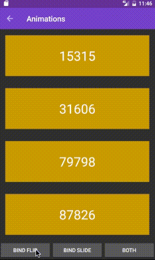

An attempt at making an easy to use view-model-binding framework for Android.

### Basic concept
Represent a views state with a view model. 

### How to use:
Define view model
```java
public class MyViewModel {

  @BindTextView(id = R.id.text_view_title)
  public String title;

  @BindTextView(id = R.id.text_view_subtitle)
  public String subTitle;

  ...

}
```
Bind view model to view
```java
MyViewModel model = new MyViewModel("The title", "The sub-title"));
Witch.bind(model, activity); // Binds to anything that contains the views defined in view model.
```
### ViewHolders built in
A view model will have its own view holder which eliminates the need for defining view holders in adapters:

```java
   @Override
    public RecyclerView.ViewHolder onCreateViewHolder(ViewGroup parent, int viewType) {
        // An empty view holder just containing the root view.
        LayoutInflater inflater = LayoutInflater.from(parent.getContext());
        return new SimpleViewHolder(inflater.inflate(R.layout.recycler_view_item, parent, false));
    }

    @Override
    public void onBindViewHolder(RecyclerView.ViewHolder holder, int position) {
        Witch.bind(items.get(position), holder.itemView);
    }
```

### Supported annotations

Direct view binding
```java
@BindToTextView
@BindToEditText
@BindToCompoundButton
@BindToImageView
@BindToRecyclerView
@BindToViewPager
@AlwaysBind
@BindToView
@BindTo
// More to come!
```

Bind to not yet supported views
```java
@BindToView(id = R.id.my_view, class = UnknownView.class, set = "myProperty")
```

Custom bind function

```java
// Must have empty constructor
public class MyOnBind implements OnBindAction<TextView, String> {

  void onBind(TextView view, String text) {
    view.setText("Prefix all texts: " + text);
  }
}

public class MyViewModel {
  @BindTo(R.id.my_id) // View
  @OnBind(MyOnBind.class) // Bind action
  public String text;
}
```

### @AlwaysBind
By default Witch wont re-bind values that has not changed in the view model. If the view model is out of sync with the actual value in the view, for example when a seekbar is changed by the user, @AlwaysBind can be used to always refresh the binding.
```java
public class MyViewModel {

  @BindToView(R.id.my_seek_bar, class = SeekBar.class, set = "progress")
  @AlwaysBind
  public Integer progess;
}
```


### Mods

Add additional actions to view model binding with @Mod
```java
@Mod(ViewModel.class)
public class ViewModelMod {
  // Same field name as in view model
  public List<BindAction> title = Arrays.asList(new MyMod());
}

public class MyMod implements OnPostBindAction<TextView, String> {

    @Override
    public void onPostBind(TextView view, String text) {
        if(text == null) {
          view.setVisibility(View.INVISIBLE);
        } else {
          view.setVisibility(View.VISIBLE);
        }
    }
}

public class ViewModel {

  @BindTextView(id = R.id.text_view_title)
  public String title;
}
```
Use in .bind() call
```java
Witch.bind(model, activity, mod);
Witch.bind(model, activity, mod1, mod2, mod3); // Use several mods
```
Mods can be used to vary binding behaviour at runtime without changing view model. One example could be to add animations.


## Goals
TODO
