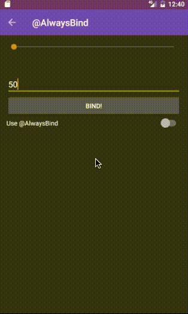

### Witch for Android

Functional view data binding.

### How to use:
Define view model
```java
public class MyViewModel {

  @BindTextView(id = R.id.title_tv)
  public String title;
  ...
}
```

Bind view model to view
```java
MyViewModel model = new MyViewModel("The title", "The sub-title"));
Witch.bind(model, activity); // Binds to anything that contains the views defined in view model.
```

### Set custom properties
Each specific bind-view-annotation sets a default property. For example, @BindTextView sets text by default.
```java
@BindTextView(id = R.id.text_view_title)
// Generates =>
((TextView)view).setText(property);
```
To set a property different from default one, use ```set=<property>```:
```java
@BindTextView(id = R.id.text_view_title, set="color")
// Generates =>
((TextView)view).setColor(property);
```

### Bind to any view type
Views not backed up by a specific annotation is supported by the @BindToView
```java
@BindToView(id = R.id.my_view, class = UnknownView.class, set = "myProperty")
// Generates =>
((UnknownView)view).setMyProperty(property)
```

### ViewHolders built in
Each view model will have its own view holder which eliminates the need for defining view holders in adapters:

```java
   @Override
    public RecyclerView.ViewHolder onCreateViewHolder(ViewGroup parent, int viewType) {
        // An empty view holder just containing the root view.
        LayoutInflater inflater = LayoutInflater.from(parent.getContext());
        return new SimpleViewHolder(inflater.inflate(R.layout.recycler_view_item, parent, false));
    }

    @Override
    public void onBindViewHolder(RecyclerView.ViewHolder holder, int position) {
        Witch.bind(items.get(position), holder.itemView);
    }
```

### Supported annotations

Direct view binding
```java
@BindToTextView
@BindToEditText
@BindToCompoundButton
@BindToImageView
@BindToRecyclerView
@BindToViewPager
@AlwaysBind
@BindToView
@BindTo
// More to come!
```

### Custom bind composition with Binder
One or more bind actions can be chained for more advanced bindings:

```java
Binder b = Binder.create(
    new SyncOnBind<TextView, String>(){
      @Override
      void onBind(TextView view, String text) {
        view.setText(text);
      }
    })
  .next(
    new SyncOnBind<TextView, String>(){
      @Override
      void onBind(TextView view, String text) {
        text.setVisibility(text == null ? View.INVISIBLE : View.VISIBLE);
      }
    });

    b.bind(view, "Hello world");
```

Use ValueBinder with @BindTo annotation

```java
class ViewModel {

  private final String amount;

  @BindTo(R.id.amount_tv)
  public ValueBinder<TextView, String> amount(){
    // Binds amount and adds "dollars"
    return ValueBinder.create(amount,  Binder.create(
      new SyncOnBind<TextView, String> {
        @Override
        public void onBind(TextView textView, String amount) {
          textView.setText(amount + " dollars");
        }
      }
    ));
  }
}
```
Define actions in separate classes for better re-use:
```java
Binder.create(new SetText<TextView, String())
.next(new AppendText<TextView, String>("dollars"));
.next(new InvisibleIfNull<TextView, String>());
```

### AsyncOnBind
Bind actions that has async dependencies, like animations, can delay bind chain with a callback.

```java
  Binder.create(
    new AsyncOnBind<TextView, String>(){
      @Override
      void onBind(TextView view, String text, final OnBindListener listener) {
        ObjectAnimator a = ObjectAnimator.ofFloat(view, View.ALPHA, 0f, 1f);
        a.setDuration(300);
        a.addListener(new AnimatorListenerAdapter() {
            @Override
            public void onAnimationEnd(Animator animation) {
                listener.onBindDone();
            }
        });
        a.start();
      }
    })
  .next(
    new SyncOnBind<TextView, String>(){
      @Override
      void onBind(TextView view, String text) {
        view.setText(text);
      }
    })
    .bind(view, "Hello world!");
```

### @AlwaysBind
By default Witch wont re-bind values that has not changed in the view model. If the view model is out of sync with the actual value in the view, for example when a seekbar is changed by the user, @AlwaysBind can be used to always refresh the binding.
```java
public class MyViewModel {

  @BindToView(R.id.my_seek_bar, class = SeekBar.class, set = "progress")
  @AlwaysBind
  public Integer progress;
}
```

